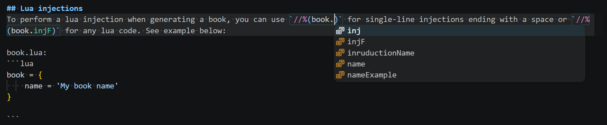

# Lua execution
One of the `mdbookshap` coolest features is the ability to execute lua scripts - this is what makes the book the best solution for role-playing games and complex solutions that contain independent logic.

## Lua files
Lua execution is provided by extensions, which you can read more about [here](./extensions.md). If you want to use Lua scripts, you should add the following into `settings.json`:
```json
{
  "Extensions": {
    "LuaExtension":{
      "ScriptsFolder":"name of folder inside src directory"
    }
  }
}
```

## Execution context
When you launch the book, all scripts from setted folder will be loaded into one Lua space, and then each MD and HTML file will be processed in accordance with the injection logic.

## Lua injections
To perform a lua injection when generating a book, you can use `//%(book.inj)` for single-line injections ending with a space or `//%(book.injF)` for any lua code. See example below:

book.lua:
```lua
book = {
    name = 'My book name'
}
```

index.md:
```md
# //%book.nameExample
```

produce:
```html
<h1 class="menu-title">My book name - Documentation</h1>
```

## Lua syntax
To see where Lua code is being injected, you can install [Lua Syntax Injector](https://marketplace.visualstudio.com/items?itemName=aneteanetes.lua-syntax-injector){target=_blank} extension. It highlights Lua code injections in any file and runs as others Visual Studio Code extensions.

Example:
